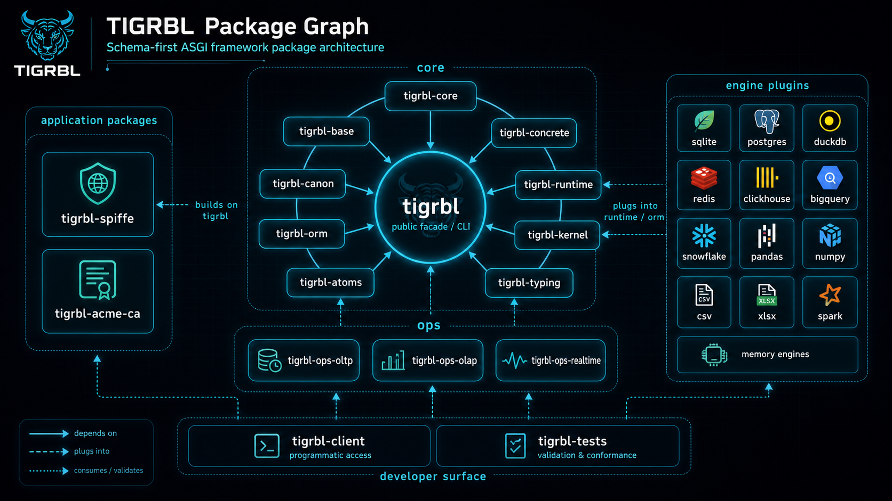

<div align="center">
<h1>Tigrbl Workspace</h1>

<p><strong>Schema-first Python workspace for REST APIs, JSON-RPC APIs, typed contracts, runtime pipelines, engine plugins, and Python runtime execution.</strong></p>
<a href="https://github.com/tigrbl/tigrbl"></a>
<a href="https://pypi.org/project/tigrbl/"></a>
<a href="https://github.com/tigrbl/tigrbl/actions/workflows/branch-coverage.yml"></a>
<a href="https://github.com/tigrbl/tigrbl/actions/workflows/publish.yml"></a>
<a href="https://hits.sh/github.com/tigrbl/tigrbl.svg"></a>
<a href="https://github.com/Tigrbl/tigrbl/blob/master/.ssot/registry.json"></a>
<a href="LICENSE"></a>
<a href="pyproject.toml"></a>
<a href="https://discord.gg/K4YTAPapjR"></a>
</div>



## What is Tigrbl Workspace?

Tigrbl is the repository for a schema-first Python framework family. It contains the public `tigrbl` facade package, split framework packages, operation packs, installable engine plugins, tests, governance docs, and Python runtime work.

Most application developers should start with the [`tigrbl`](https://pypi.org/project/tigrbl/) distribution. This root README is the repository and workspace entry point; the PyPI-facing facade package README lives at [`pkgs/core/tigrbl/README.md`](https://github.com/tigrbl/tigrbl/tree/master/pkgs/core/tigrbl). Package-local README files under `pkgs/` document install targets, package boundaries, dependency surfaces, and links back to governed docs.

## Why use Tigrbl?

Use Tigrbl when you want one schema-first authoring model to project API behavior across REST, JSON-RPC, OpenAPI, OpenRPC, diagnostics, hooks, runtime plans, engine-backed handlers, and typed request/response models.

The workspace is organized so application code can use a stable facade while framework maintainers can work on narrow layers: core specs, base contracts, concrete adapters, atoms, kernel planning, runtime execution, operation packs, ORM helpers, and engines.

## When should I install Tigrbl?

Install `tigrbl` for application projects, examples, service skeletons, and teams that want the public Python authoring surface in one dependency:

```bash
uv add tigrbl
```

```bash
pip install tigrbl
```

Optional facade extras declared by the package include:

```bash
pip install "tigrbl[postgres,servers,templates,tests]"
```

Use split packages when you intentionally need a narrower dependency surface, such as `tigrbl-core` for specs, `tigrbl-base` for abstract contracts, `tigrbl-runtime` for runtime execution, `tigrbl-orm` for SQLAlchemy-facing helpers, or `tigrbl-engine-*` packages for backend-specific integrations.

## Who is Tigrbl for?

Tigrbl is for application developers, platform teams, extension authors, and framework maintainers building schema-first Python APIs with consistent operation, schema, transport, diagnostics, and engine behavior.

Application developers should normally import through the `tigrbl` facade. Extension authors and maintainers should use the split packages only when they are intentionally implementing or testing a framework boundary.

## Where does Tigrbl fit?

This repository lives at [`tigrbl/tigrbl`](https://github.com/tigrbl/tigrbl). It is the upstream workspace for the Python package family published to PyPI and for repository-governed documentation, CI validation, release evidence, and SSOT metadata.

The root workspace does not define an application package. Ready-made application boundaries such as `tigrbl_acme_ca` and `tigrbl_spiffe` live in independent repositories and consume Tigrbl packages.

## How does Tigrbl work?

Tigrbl separates authoring intent from runtime execution:

- The `tigrbl` facade exposes stable application imports, decorators, factories, shortcuts, schema helpers, and engine helpers.
- Core specs describe app, router, table, column, operation, hook, schema, response, binding, engine, storage, docs, session, and middleware intent.
- Base contracts define abstract interfaces and mapping helpers.
- Concrete adapters lower specs and base contracts into usable app/router/table/operation/docs/diagnostics/engine/transport behavior.
- Atoms and kernel packages build reviewable phase plans and dispatch metadata.
- Runtime packages execute compiled plans across request, stream, message, session, and transport-unit flows.
- Operation packs provide canonical CRUD, analytical, and realtime operation definitions.
- Engine packages provide backend-specific persistence, cache, queue, rate, bloom, dedupe, dataframe, warehouse, and database integrations.

## Certification Status

- Workspace status: governed Python workspace in the [`tigrbl/tigrbl`](https://github.com/tigrbl/tigrbl) repository.
- Governance source: [SSOT registry](https://github.com/tigrbl/tigrbl/blob/master/.ssot/registry.json).
- Release evidence: [publish workflow](https://github.com/tigrbl/tigrbl/actions/workflows/publish.yml) validates package builds, tests, GitHub release assets, and PyPI publication for managed packages.
- Local certification guard: `pkgs/core/tigrbl_tests/tests/unit/test_package_badges_and_notices.py` verifies package README badges, legal pointers, and required package sections.
- Scope note: this root README documents the repository and workspace boundary. Runtime feature support remains governed by `.ssot/` entities and the conformance docs linked below.

## Install and Work on the Workspace

Clone and install the workspace for development:

```bash
git clone https://github.com/tigrbl/tigrbl.git
cd tigrbl
uv sync --all-extras --dev
```

Run the primary package CLI after installing the facade:

```bash
tigrbl --help
python -m tigrbl --help
```

The root `pyproject.toml` is a uv workspace manifest and is not itself a publishable package. It declares workspace membership under `pkgs/core/*`, `pkgs/deprecated/*`, and `pkgs/engines/*`, plus development dependencies for tests, CI validation, server compatibility, package builds, and release tooling.

## Surface Coverage

| Surface | Value |
|---|---|
| GitHub repository | [`tigrbl/tigrbl`](https://github.com/tigrbl/tigrbl) |
| Root workspace manifest | [`pyproject.toml`](https://github.com/tigrbl/tigrbl/blob/master/pyproject.toml) |
| Primary PyPI package | [`tigrbl`](https://pypi.org/project/tigrbl/) |
| Primary package path | [`pkgs/core/tigrbl`](https://github.com/tigrbl/tigrbl/tree/master/pkgs/core/tigrbl) |
| Workspace package roots | `pkgs/core/*`, `pkgs/engines/*`, `pkgs/deprecated/*` |
| Python import roots | `tigrbl`, `tigrbl_core`, `tigrbl_base`, `tigrbl_concrete`, `tigrbl_runtime`, `tigrbl_atoms`, `tigrbl_kernel`, `tigrbl_orm`, operation packs, engine packages, and support packages |
| Console scripts | `tigrbl` from the facade package |
| Current package line | `0.4.1` |
| Supported Python | `3.10, 3.11, 3.12, 3.13, 3.14` |
| Legal files | `LICENSE`, `NOTICE`, package-local legal files |
| Governance docs | `docs/README.md`, `docs/governance/DOC_POINTERS.md`, `.ssot/registry.json` |
| Release evidence | `docs/conformance/releases/`, `docs/conformance/dev/`, `.github/workflows/publish.yml` |

## What It Does

This repository owns the framework package family and the workspace-level proof and documentation surfaces around it.

Do:

- Do use this repository to maintain the public facade, split core framework packages, operation packs, engine plugins, tests, governance validators, release evidence, and package documentation.
- Do use package-local README files to explain package boundaries, install targets, import roots, dependency surfaces, usage examples, and links to governed docs.
- Do use `.ssot/` and conformance docs for governed feature, claim, release, evidence, and target-state questions.
- Do keep workspace docs aligned with the package family that is actually published to PyPI.

Do not:

- Do not treat this root workspace as an importable Python package.
- Do not add application-specific business logic to the root repository boundary when it belongs in an application repository or package.
- Do not make package-local README files the source of truth for conformance state; use governed docs and SSOT records.
- Do not widen a package boundary by adding dependencies or imports that belong in another split package.

Avoid:

- Avoid using the root README as the only documentation for a distributable. Each package README should still explain its own install target and boundary.
- Avoid duplicating release claims outside governed evidence records.
- Avoid moving application examples toward FastAPI, Starlette, direct SQLAlchemy authoring, or direct DB/session method calls when Tigrbl-owned authoring surfaces can express the behavior.

## Public API and Import Surfaces

The repository-level public API is the published package family. Application code normally starts with `tigrbl`; lower-level packages are for extension, testing, or framework maintenance.

| Package | Import root | Primary use |
|---|---|---|
| [`tigrbl`](https://pypi.org/project/tigrbl/) | `tigrbl` | Public application facade, app/router factories, decorators, schema helpers, engine helpers, CLI |
| [`tigrbl-core`](https://pypi.org/project/tigrbl-core/) | `tigrbl_core` | Core specs, config resolution, operation vocabulary, schema generation |
| [`tigrbl-base`](https://pypi.org/project/tigrbl-base/) | `tigrbl_base` | Abstract contracts, mapping helpers, column inference |
| [`tigrbl-concrete`](https://pypi.org/project/tigrbl-concrete/) | `tigrbl_concrete` | Concrete adapters, decorators, docs, diagnostics, engine resolution, transport helpers |
| [`tigrbl-runtime`](https://pypi.org/project/tigrbl-runtime/) | `tigrbl_runtime` | Runtime-owned routing, execution, and transport-unit handling |
| [`tigrbl-atoms`](https://pypi.org/project/tigrbl-atoms/) | `tigrbl_atoms` | Phase names, atom implementations, typed contexts, runtime units |
| [`tigrbl-kernel`](https://pypi.org/project/tigrbl-kernel/) | `tigrbl_kernel` | Kernel planning, packed plans, protocol chains, labels, capability masks |
| [`tigrbl-orm`](https://pypi.org/project/tigrbl-orm/) | `tigrbl_orm` | SQLAlchemy-facing table, mixin, column, and persistence helpers |
| [`tigrbl-ops-oltp`](https://pypi.org/project/tigrbl-ops-oltp/) | `tigrbl_ops_oltp` | Canonical CRUD and transactional operations |
| [`tigrbl-ops-olap`](https://pypi.org/project/tigrbl-ops-olap/) | `tigrbl_ops_olap` | Analytical operation definitions |
| [`tigrbl-ops-realtime`](https://pypi.org/project/tigrbl-ops-realtime/) | `tigrbl_ops_realtime` | Realtime, streaming, pub/sub, and transport-oriented operations |
| [`tigrbl-client`](https://pypi.org/project/tigrbl_client/) | `tigrbl_client` | Client helpers |
| [`tigrbl-typing`](https://pypi.org/project/tigrbl-typing/) | `tigrbl_typing` | Shared typing and vendor-compatible types |
| [`tigrbl_spec`](https://pypi.org/project/tigrbl_spec/) | `tigrbl_spec` | Spec support package |
| [`tigrbl_tests`](https://pypi.org/project/tigrbl_tests/) | `tigrbl_tests` | Test harnesses, examples, conformance and package tests |

## Usage Examples

### Verify the workspace checkout

```bash
uv sync --all-extras --dev
python -m pytest -q tools/ci/tests/test_governance_validators.py
```

### Verify the installed facade package

```bash
python -m pip show tigrbl
python - <<'PY'
from importlib.metadata import version
print(version("tigrbl"))
PY
```

### Create a small Tigrbl app shell

```python
from tigrbl import TigrblApp, TigrblRouter

app = TigrblApp()
router = TigrblRouter()
app.include_router(router)
```

### Use author-facing decorators

```python
from tigrbl import get, post

@get("/health")
def health() -> dict[str, str]:
    return {"status": "ok"}

@post("/items")
def create_item(payload: dict) -> dict:
    return payload
```

### Inspect package boundaries

```bash
python - <<'PY'
import importlib

for name in ["tigrbl", "tigrbl_core", "tigrbl_base", "tigrbl_concrete"]:
    module = importlib.import_module(name)
    print(name, "->", module.__name__)
PY
```

## Framework Catalog

Tigrbl is organized as a split framework behind the facade:

| Layer | Package | PyPI | GitHub path | Responsibility |
|---|---|---|---|---|
| Facade | `tigrbl` | [`tigrbl`](https://pypi.org/project/tigrbl/) | [`pkgs/core/tigrbl`](https://github.com/tigrbl/tigrbl/tree/master/pkgs/core/tigrbl) | Public authoring imports, shortcuts, compatibility modules, CLI entry point, and application-facing docs |
| Core specs | `tigrbl-core` | [`tigrbl-core`](https://pypi.org/project/tigrbl-core/) | [`pkgs/core/tigrbl_core`](https://github.com/tigrbl/tigrbl/tree/master/pkgs/core/tigrbl_core) | App, router, table, column, op, hook, schema, response, binding, engine, storage, path, docs, session, and middleware specs |
| Base contracts | `tigrbl-base` | [`tigrbl-base`](https://pypi.org/project/tigrbl-base/) | [`pkgs/core/tigrbl_base`](https://github.com/tigrbl/tigrbl/tree/master/pkgs/core/tigrbl_base) | Abstract app/router/table/session/request/response/binding/security/middleware/storage interfaces and mapping helpers |
| Concrete adapters | `tigrbl-concrete` | [`tigrbl-concrete`](https://pypi.org/project/tigrbl-concrete/) | [`pkgs/core/tigrbl_concrete`](https://github.com/tigrbl/tigrbl/tree/master/pkgs/core/tigrbl_concrete) | Concrete app/router/table/response/request/security/decorator/engine/system/transport implementations |
| Atoms | `tigrbl-atoms` | [`tigrbl-atoms`](https://pypi.org/project/tigrbl-atoms/) | [`pkgs/core/tigrbl_atoms`](https://github.com/tigrbl/tigrbl/tree/master/pkgs/core/tigrbl_atoms) | Phase names, stage transitions, contexts, atom implementations, transactions, batch atoms, and transport atoms |
| Kernel | `tigrbl-kernel` | [`tigrbl-kernel`](https://pypi.org/project/tigrbl-kernel/) | [`pkgs/core/tigrbl_kernel`](https://github.com/tigrbl/tigrbl/tree/master/pkgs/core/tigrbl_kernel) | Operation-view compilation, hook ordering, labels, packed plans, protocol chains, lifecycle rows, event keys, capability masks, and dispatch plans |
| Runtime | `tigrbl-runtime` | [`tigrbl-runtime`](https://pypi.org/project/tigrbl-runtime/) | [`pkgs/core/tigrbl_runtime`](https://github.com/tigrbl/tigrbl/tree/master/pkgs/core/tigrbl_runtime) | Runtime-owned routing, request execution, framing atoms, transport channels, transactions, and Python execution |
| Operation packs | `tigrbl-ops-*` | [`oltp`](https://pypi.org/project/tigrbl-ops-oltp/), [`olap`](https://pypi.org/project/tigrbl-ops-olap/), [`realtime`](https://pypi.org/project/tigrbl-ops-realtime/) | [`pkgs/core`](https://github.com/tigrbl/tigrbl/tree/master/pkgs/core) | Canonical operation definitions for CRUD, analytics, realtime, streaming, pub/sub, and transport workloads |
| ORM | `tigrbl-orm` | [`tigrbl-orm`](https://pypi.org/project/tigrbl-orm/) | [`pkgs/core/tigrbl_orm`](https://github.com/tigrbl/tigrbl/tree/master/pkgs/core/tigrbl_orm) | SQLAlchemy-facing table and mixin helpers used by Tigrbl models and internals |
| Engines | `tigrbl-engine-*` | Engine PyPI distributions | [`pkgs/engines`](https://github.com/tigrbl/tigrbl/tree/master/pkgs/engines) | Backend-specific persistence, cache, queue, rate, bloom, dedupe, dataframe, warehouse, and database integrations |

Use the facade for application code unless you are maintaining a framework layer, testing a boundary in isolation, or writing a package that intentionally plugs into one of the lower layers.

## Authoring BCP

Tigrbl application code should stay on Tigrbl-owned authoring surfaces. The detailed policy is in [`docs/developer/AUTHORING_BCP.md`](https://github.com/tigrbl/tigrbl/blob/master/docs/developer/AUTHORING_BCP.md); this root README states the repository-level rule for contributors, examples, package docs, and workspace maintenance.

Do:

- Do build application services with `TigrblApp`, `TigrblRouter`, Tigrbl facade decorators, table helpers, column helpers, operation specs, hook specs, binding specs, engine specs, and generated schemas.
- Do model domain behavior as Tigrbl operations and handlers so REST, JSON-RPC, OpenAPI, OpenRPC, `/system/methodz`, `/system/hookz`, `/system/kernelz`, schemas, and tests all describe the same behavior.
- Do express field behavior through Tigrbl table, column, datatype, storage, IO, request, response, and operation specs.
- Do bind engines declaratively at app, router, table, or operation scope.
- Do put authentication, authorization, validation, enrichment, auditing, and response shaping in security dependencies or lifecycle hooks such as `PRE_HANDLER`, `POST_HANDLER`, `EGRESS_SHAPE`, and `POST_RESPONSE`.
- Do let kernel/runtime phases own dispatch and transaction progression.
- Do make README examples use Tigrbl facade imports unless the example is explicitly a lower-layer test, benchmark, migration, engine adapter, or framework-internal compatibility example.

Do not:

- Do not author Tigrbl application endpoints with FastAPI `FastAPI`, `APIRouter`, dependency wiring, route decorators, middleware registration, docs generation, or lifecycle hooks.
- Do not author Tigrbl application endpoints with Starlette route, request, response, middleware, background-task, or lifecycle classes.
- Do not use raw SQLAlchemy `mapped_column(...)` or `Column(...)` as the primary application authoring surface when Tigrbl column helpers or specs can represent the field behavior.
- Do not create ad-hoc SQLAlchemy engines, sessions, or sessionmakers inside request handlers.
- Do not call direct database/session methods such as `flush()` or `commit()` from application hooks or handlers.
- Do not bypass operation specs, handlers, kernel plans, runtime atoms, or lifecycle phases with one-off route wrappers for model behavior.
- Do not make benchmark or compatibility fixtures look like recommended application style.

Avoid:

- Avoid treating ASGI, FastAPI, Starlette, SQLAlchemy ORM materialization, or direct DB methods as the application contract. They may appear behind Tigrbl-owned internals, engine adapters, compatibility tests, or benchmarks, but not as the recommended user-facing authoring path.
- Avoid duplicating field and payload rules across SQLAlchemy, Pydantic, route handlers, and docs. Put reusable rules in specs and retrieve operation payload models through schema helpers such as `get_schema(...)`.
- Avoid README examples that teach lower-level framework internals as normal application style unless the example is explicitly marked as a test, benchmark, migration, engine adapter, or framework-internal compatibility surface.
- Avoid adding transport-only shortcuts that make REST, JSON-RPC, docs, diagnostics, hooks, and tests disagree about what the service supports.

## Default CRUD and Operation Semantics

The facade package defines the canonical default operation set as `create`, `read`, `update`, `replace`, `delete`, `list`, and `clear`. Tables can opt out, opt into a subset, or add explicit operation specs. Operation packs add bulk, analytical, realtime, stream, and transport-oriented verbs.

| Operation | REST shape | JSON-RPC shape | Arity | Semantics |
|---|---|---|---|---|
| `create` | `POST /{resource}` | `Model.create` | collection | Validate input, apply defaults/policies, persist one record, return the output schema |
| `read` | `GET /{resource}/{id}` | `Model.read` | member | Fetch one record by identity and serialize through the output schema |
| `update` | `PATCH /{resource}/{id}` | `Model.update` | member | Apply partial update semantics; omitted fields remain unchanged |
| `replace` | `PUT /{resource}/{id}` | `Model.replace` | member | Apply replacement semantics; submitted representation is the desired record shape |
| `delete` | `DELETE /{resource}/{id}` | `Model.delete` | member | Remove or policy-delete one record and return the configured result envelope |
| `list` | `GET /{resource}` | `Model.list` | collection | Resolve filters, pagination, ordering, visibility policy, and output collection shape |
| `clear` | `DELETE /{resource}` | `Model.clear` | collection | Delete a collection according to policy and filter configuration |
| `bulk_*` | collection route | `Model.bulk_*` | collection | Enabled by operation specs, mixins, or explicit table configuration |
| `custom` | op-defined | op-defined | op-defined | Use explicit operation specs for domain-specific verbs while keeping schemas, hooks, and policies unified |

Route conflicts are intentional. JSON-RPC methods remain independently addressable by method name, so RPC is the right surface when scalar and bulk forms must be exposed without path ambiguity.

## REST, JSON-RPC, And Transport Projection

Tigrbl projects operation inventory across protocol surfaces while keeping protocol, exchange, and framing separate.

| Surface | Binding family | Framing | Primary use |
|---|---|---|---|
| REST over HTTP/HTTPS | request | JSON | Resource-oriented CRUD and conventional HTTP clients |
| JSON-RPC over HTTP/HTTPS | request | JSON-RPC | Method-oriented clients, batch-capable RPC contracts, and OpenRPC generation |
| HTTP stream | stream | stream or configured stream framing | Server-streaming outputs and progressive responses |
| SSE | stream | SSE | Browser-friendly event streams |
| WebSocket/WSS | message | text or JSON-RPC when negotiated | Bidirectional message workflows |
| WebTransport | session, stream, or datagram | WebTransport outer framing plus lane-specific inner framing | Session, stream, and datagram transports with fail-closed lane validation |

Strict JSON-RPC document framing is `jsonrpc`; newline-delimited JSON-RPC should be modeled distinctly rather than collapsed into plain `ndjson`. Unsupported combinations fail closed during binding or runtime planning instead of being guessed.

## Request Lifecycle and Hook Phases

Runtime-owned routing flows through stable phases. Hooks attach to phases, atoms provide framework work, and the kernel records the plan used for each model operation.

| Phase | Role |
|---|---|
| `INGRESS_BEGIN` | Start request or transport-unit handling and initialize context |
| `INGRESS_PARSE` | Parse transport payloads, request metadata, path variables, query data, or message bodies |
| `INGRESS_DISPATCH` | Resolve the target operation, binding, and protocol subevent |
| `PRE_TX_BEGIN` | Run pre-transaction checks before a database transaction exists |
| `START_TX` | Open or attach transaction/session state when the operation requires it |
| `PRE_HANDLER` | Resolve dependencies, validate inputs, enforce policy, and prepare handler state |
| `HANDLER` | Execute the operation handler or system handler |
| `POST_HANDLER` | Normalize handler output and run in-transaction post-processing |
| `PRE_COMMIT` | Run final in-transaction checks before commit |
| `TX_COMMIT` | Flush/commit when Tigrbl owns the transaction |
| `POST_COMMIT` | Run committed-side effects before response shaping |
| `EGRESS_SHAPE` | Build response envelopes, apply masks, negotiate output shape, and prepare transport response data |
| `EGRESS_FINALIZE` | Apply headers/status/renderers and finalize transport response |
| `POST_RESPONSE` | Run after-response work that should not affect the returned payload |
| `ON_*_ERROR` | Phase-specific error handling; falls back to `ON_ERROR` when no specific chain handles the failure |
| `TX_ROLLBACK` | Roll back transaction-owned work and perform cleanup |

Use hooks for policy, validation, enrichment, audit, response shaping, and post-response work. Keep core persistence and transport handling inside operations, atoms, and lifecycle phases so REST, JSON-RPC, diagnostics, and schemas stay aligned.

## Engine and Session Semantics

Engines are declared through specs, providers, decorators, or concrete engine instances. Resolution chooses the most specific binding:

```text
operation > table/model > router > app > defaults
```

Use engine specs and Tigrbl's engine decorators instead of creating ad-hoc SQLAlchemy engines inside handlers. Database sessions are guarded by lifecycle phase. Do not call `flush()` or `commit()` directly from application hooks or handlers unless you are implementing a framework-level atom with the correct guard contract.

## Configuration and Schema Precedence

Tigrbl resolves configuration by layering broad defaults first and specific intent last:

```text
per-request overrides > operation spec > column spec > table spec > router spec > app spec > framework defaults
```

Use that same mental model for schema, response, path, engine, and operation behavior. Put shared policy at app/router scope, model-specific behavior at table scope, field behavior at column scope, and exceptional behavior in operation specs or request overrides.

## Package Catalog

### Core Python Packages

| Package | PyPI | GitHub path | Import root |
|---|---|---|---|
| `tigrbl` | [`tigrbl`](https://pypi.org/project/tigrbl/) | [`pkgs/core/tigrbl`](https://github.com/tigrbl/tigrbl/tree/master/pkgs/core/tigrbl) | `tigrbl` |
| `tigrbl-atoms` | [`tigrbl-atoms`](https://pypi.org/project/tigrbl-atoms/) | [`pkgs/core/tigrbl_atoms`](https://github.com/tigrbl/tigrbl/tree/master/pkgs/core/tigrbl_atoms) | `tigrbl_atoms` |
| `tigrbl-base` | [`tigrbl-base`](https://pypi.org/project/tigrbl-base/) | [`pkgs/core/tigrbl_base`](https://github.com/tigrbl/tigrbl/tree/master/pkgs/core/tigrbl_base) | `tigrbl_base` |
| `tigrbl-canon` | [`tigrbl-canon`](https://pypi.org/project/tigrbl-canon/) | [`pkgs/deprecated/tigrbl_canon`](https://github.com/tigrbl/tigrbl/tree/master/pkgs/deprecated/tigrbl_canon) | `tigrbl_canon` |
| `tigrbl_client` | [`tigrbl_client`](https://pypi.org/project/tigrbl_client/) | [`pkgs/core/tigrbl_client`](https://github.com/tigrbl/tigrbl/tree/master/pkgs/core/tigrbl_client) | `tigrbl_client` |
| `tigrbl-concrete` | [`tigrbl-concrete`](https://pypi.org/project/tigrbl-concrete/) | [`pkgs/core/tigrbl_concrete`](https://github.com/tigrbl/tigrbl/tree/master/pkgs/core/tigrbl_concrete) | `tigrbl_concrete` |
| `tigrbl-core` | [`tigrbl-core`](https://pypi.org/project/tigrbl-core/) | [`pkgs/core/tigrbl_core`](https://github.com/tigrbl/tigrbl/tree/master/pkgs/core/tigrbl_core) | `tigrbl_core` |
| `tigrbl-kernel` | [`tigrbl-kernel`](https://pypi.org/project/tigrbl-kernel/) | [`pkgs/core/tigrbl_kernel`](https://github.com/tigrbl/tigrbl/tree/master/pkgs/core/tigrbl_kernel) | `tigrbl_kernel` |
| `tigrbl-ops-olap` | [`tigrbl-ops-olap`](https://pypi.org/project/tigrbl-ops-olap/) | [`pkgs/core/tigrbl_ops_olap`](https://github.com/tigrbl/tigrbl/tree/master/pkgs/core/tigrbl_ops_olap) | `tigrbl_ops_olap` |
| `tigrbl-ops-oltp` | [`tigrbl-ops-oltp`](https://pypi.org/project/tigrbl-ops-oltp/) | [`pkgs/core/tigrbl_ops_oltp`](https://github.com/tigrbl/tigrbl/tree/master/pkgs/core/tigrbl_ops_oltp) | `tigrbl_ops_oltp` |
| `tigrbl-ops-realtime` | [`tigrbl-ops-realtime`](https://pypi.org/project/tigrbl-ops-realtime/) | [`pkgs/core/tigrbl_ops_realtime`](https://github.com/tigrbl/tigrbl/tree/master/pkgs/core/tigrbl_ops_realtime) | `tigrbl_ops_realtime` |
| `tigrbl-orm` | [`tigrbl-orm`](https://pypi.org/project/tigrbl-orm/) | [`pkgs/core/tigrbl_orm`](https://github.com/tigrbl/tigrbl/tree/master/pkgs/core/tigrbl_orm) | `tigrbl_orm` |
| `tigrbl-runtime` | [`tigrbl-runtime`](https://pypi.org/project/tigrbl-runtime/) | [`pkgs/core/tigrbl_runtime`](https://github.com/tigrbl/tigrbl/tree/master/pkgs/core/tigrbl_runtime) | `tigrbl_runtime` |
| `tigrbl_spec` | [`tigrbl_spec`](https://pypi.org/project/tigrbl_spec/) | [`pkgs/core/tigrbl_spec`](https://github.com/tigrbl/tigrbl/tree/master/pkgs/core/tigrbl_spec) | `tigrbl_spec` |
| `tigrbl_tests` | [`tigrbl_tests`](https://pypi.org/project/tigrbl_tests/) | [`pkgs/core/tigrbl_tests`](https://github.com/tigrbl/tigrbl/tree/master/pkgs/core/tigrbl_tests) | `tigrbl_tests` |
| `tigrbl-typing` | [`tigrbl-typing`](https://pypi.org/project/tigrbl-typing/) | [`pkgs/core/tigrbl_typing`](https://github.com/tigrbl/tigrbl/tree/master/pkgs/core/tigrbl_typing) | `tigrbl_typing` |

### Engine Packages

| Package | PyPI | GitHub path | Primary use |
|---|---|---|---|
| `tigrbl_engine_bigquery` | [`tigrbl_engine_bigquery`](https://pypi.org/project/tigrbl_engine_bigquery/) | [`pkgs/engines/tigrbl_engine_bigquery`](https://github.com/tigrbl/tigrbl/tree/master/pkgs/engines/tigrbl_engine_bigquery) | BigQuery integration |
| `tigrbl_engine_clickhouse` | [`tigrbl_engine_clickhouse`](https://pypi.org/project/tigrbl_engine_clickhouse/) | [`pkgs/engines/tigrbl_engine_clickhouse`](https://github.com/tigrbl/tigrbl/tree/master/pkgs/engines/tigrbl_engine_clickhouse) | ClickHouse integration |
| `tigrbl_engine_csv` | [`tigrbl_engine_csv`](https://pypi.org/project/tigrbl_engine_csv/) | [`pkgs/engines/tigrbl_engine_csv`](https://github.com/tigrbl/tigrbl/tree/master/pkgs/engines/tigrbl_engine_csv) | CSV-backed workflows |
| `tigrbl_engine_dataframe` | [`tigrbl_engine_dataframe`](https://pypi.org/project/tigrbl_engine_dataframe/) | [`pkgs/engines/tigrbl_engine_dataframe`](https://github.com/tigrbl/tigrbl/tree/master/pkgs/engines/tigrbl_engine_dataframe) | DataFrame workflows |
| `tigrbl_engine_duckdb` | [`tigrbl_engine_duckdb`](https://pypi.org/project/tigrbl_engine_duckdb/) | [`pkgs/engines/tigrbl_engine_duckdb`](https://github.com/tigrbl/tigrbl/tree/master/pkgs/engines/tigrbl_engine_duckdb) | DuckDB integration |
| `tigrbl_engine_inmemcache` | [`tigrbl_engine_inmemcache`](https://pypi.org/project/tigrbl_engine_inmemcache/) | [`pkgs/engines/tigrbl_engine_inmemcache`](https://github.com/tigrbl/tigrbl/tree/master/pkgs/engines/tigrbl_engine_inmemcache) | In-memory cache |
| `tigrbl_engine_inmemory` | [`tigrbl_engine_inmemory`](https://pypi.org/project/tigrbl_engine_inmemory/) | [`pkgs/engines/tigrbl_engine_inmemory`](https://github.com/tigrbl/tigrbl/tree/master/pkgs/engines/tigrbl_engine_inmemory) | In-memory persistence |
| `tigrbl_engine_membloom` | [`tigrbl_engine_membloom`](https://pypi.org/project/tigrbl_engine_membloom/) | [`pkgs/engines/tigrbl_engine_membloom`](https://github.com/tigrbl/tigrbl/tree/master/pkgs/engines/tigrbl_engine_membloom) | In-memory bloom filters |
| `tigrbl_engine_memdedupe` | [`tigrbl_engine_memdedupe`](https://pypi.org/project/tigrbl_engine_memdedupe/) | [`pkgs/engines/tigrbl_engine_memdedupe`](https://github.com/tigrbl/tigrbl/tree/master/pkgs/engines/tigrbl_engine_memdedupe) | In-memory dedupe |
| `tigrbl_engine_memkv` | [`tigrbl_engine_memkv`](https://pypi.org/project/tigrbl_engine_memkv/) | [`pkgs/engines/tigrbl_engine_memkv`](https://github.com/tigrbl/tigrbl/tree/master/pkgs/engines/tigrbl_engine_memkv) | In-memory key-value storage |
| `tigrbl_engine_memlru` | [`tigrbl_engine_memlru`](https://pypi.org/project/tigrbl_engine_memlru/) | [`pkgs/engines/tigrbl_engine_memlru`](https://github.com/tigrbl/tigrbl/tree/master/pkgs/engines/tigrbl_engine_memlru) | In-memory LRU cache |
| `tigrbl_engine_mempubsub` | [`tigrbl_engine_mempubsub`](https://pypi.org/project/tigrbl_engine_mempubsub/) | [`pkgs/engines/tigrbl_engine_mempubsub`](https://github.com/tigrbl/tigrbl/tree/master/pkgs/engines/tigrbl_engine_mempubsub) | In-memory pub/sub |
| `tigrbl_engine_memqueue` | [`tigrbl_engine_memqueue`](https://pypi.org/project/tigrbl_engine_memqueue/) | [`pkgs/engines/tigrbl_engine_memqueue`](https://github.com/tigrbl/tigrbl/tree/master/pkgs/engines/tigrbl_engine_memqueue) | In-memory queues |
| `tigrbl_engine_memrate` | [`tigrbl_engine_memrate`](https://pypi.org/project/tigrbl_engine_memrate/) | [`pkgs/engines/tigrbl_engine_memrate`](https://github.com/tigrbl/tigrbl/tree/master/pkgs/engines/tigrbl_engine_memrate) | In-memory rate limits |
| `tigrbl_engine_numpy` | [`tigrbl_engine_numpy`](https://pypi.org/project/tigrbl_engine_numpy/) | [`pkgs/engines/tigrbl_engine_numpy`](https://github.com/tigrbl/tigrbl/tree/master/pkgs/engines/tigrbl_engine_numpy) | NumPy-backed workflows |
| `tigrbl_engine_pandas` | [`tigrbl_engine_pandas`](https://pypi.org/project/tigrbl_engine_pandas/) | [`pkgs/engines/tigrbl_engine_pandas`](https://github.com/tigrbl/tigrbl/tree/master/pkgs/engines/tigrbl_engine_pandas) | Pandas-backed workflows |
| `tigrbl_engine_pgsqli_wal` | [`tigrbl_engine_pgsqli_wal`](https://pypi.org/project/tigrbl_engine_pgsqli_wal/) | [`pkgs/engines/tigrbl_engine_pgsqli_wal`](https://github.com/tigrbl/tigrbl/tree/master/pkgs/engines/tigrbl_engine_pgsqli_wal) | PostgreSQL/SQLite WAL workflows |
| `tigrbl_engine_postgres` | [`tigrbl_engine_postgres`](https://pypi.org/project/tigrbl_engine_postgres/) | [`pkgs/engines/tigrbl_engine_postgres`](https://github.com/tigrbl/tigrbl/tree/master/pkgs/engines/tigrbl_engine_postgres) | PostgreSQL integration |
| `tigrbl_engine_pyspark` | [`tigrbl_engine_pyspark`](https://pypi.org/project/tigrbl_engine_pyspark/) | [`pkgs/engines/tigrbl_engine_pyspark`](https://github.com/tigrbl/tigrbl/tree/master/pkgs/engines/tigrbl_engine_pyspark) | PySpark workflows |
| `tigrbl_engine_redis` | [`tigrbl_engine_redis`](https://pypi.org/project/tigrbl_engine_redis/) | [`pkgs/engines/tigrbl_engine_redis`](https://github.com/tigrbl/tigrbl/tree/master/pkgs/engines/tigrbl_engine_redis) | Redis integration |
| `tigrbl_engine_rediscachethrough` | [`tigrbl_engine_rediscachethrough`](https://pypi.org/project/tigrbl_engine_rediscachethrough/) | [`pkgs/engines/tigrbl_engine_rediscachethrough`](https://github.com/tigrbl/tigrbl/tree/master/pkgs/engines/tigrbl_engine_rediscachethrough) | Redis cache-through integration |
| `tigrbl_engine_snowflake` | [`tigrbl_engine_snowflake`](https://pypi.org/project/tigrbl_engine_snowflake/) | [`pkgs/engines/tigrbl_engine_snowflake`](https://github.com/tigrbl/tigrbl/tree/master/pkgs/engines/tigrbl_engine_snowflake) | Snowflake integration |
| `tigrbl_engine_sqlite` | [`tigrbl_engine_sqlite`](https://pypi.org/project/tigrbl_engine_sqlite/) | [`pkgs/engines/tigrbl_engine_sqlite`](https://github.com/tigrbl/tigrbl/tree/master/pkgs/engines/tigrbl_engine_sqlite) | SQLite integration |
| `tigrbl_engine_xlsx` | [`tigrbl_engine_xlsx`](https://pypi.org/project/tigrbl_engine_xlsx/) | [`pkgs/engines/tigrbl_engine_xlsx`](https://github.com/tigrbl/tigrbl/tree/master/pkgs/engines/tigrbl_engine_xlsx) | XLSX-backed workflows |

### Runtime Execution

Tigrbl runtime execution is Python-only. Rust-named runtime, kernel, atom, handler, and engine compatibility modules have been removed from this repository.

## How To Choose a Package

- Choose [`tigrbl`](https://pypi.org/project/tigrbl/) when you want the full public facade: app composition, schema-first routing, REST and JSON-RPC projection, docs generation, engine integration, and CLI workflow.
- Choose [`tigrbl-core`](https://pypi.org/project/tigrbl-core/) when you need spec classes, operation collection, schema generation, or config resolution without concrete app/router/runtime imports.
- Choose [`tigrbl-base`](https://pypi.org/project/tigrbl-base/) when you are writing concrete adapters, engine adapters, or framework tests that need abstract contracts.
- Choose [`tigrbl-concrete`](https://pypi.org/project/tigrbl-concrete/) when you need concrete classes, decorators, engine resolution, docs mounting, or diagnostics without taking the facade dependency.
- Choose [`tigrbl-runtime`](https://pypi.org/project/tigrbl-runtime/) when you are maintaining runtime execution, transport-unit handling, or transaction helpers.
- Choose operation packs when you need canonical CRUD, analytical, realtime, stream, or transport-oriented operation definitions.
- Choose engine packages when you need a backend-specific dependency surface for SQLite, Postgres, Redis, Snowflake, BigQuery, DuckDB, warehouse, tabular, or in-memory workflows.

## Best Practices

- Use `tigrbl` facade imports in application code; import split packages directly only for framework extension work.
- Model domain actions as operations, not ad-hoc routes, so REST, JSON-RPC, schemas, hooks, OpenAPI, OpenRPC, and diagnostics stay in sync.
- Use `get_schema(...)` or schema helpers for request/response envelopes instead of hand-rolled Pydantic classes when the payload belongs to a Tigrbl operation.
- Keep table, column, datatype, storage, IO, request, response, hook, and operation behavior in specs where possible.
- Bind engines declaratively at app, router, table, or operation scope; do not create engines inside request handlers.
- Let the lifecycle own transaction boundaries; avoid direct `flush()`, `commit()`, and SQLAlchemy session mutation from user hooks.
- Put authentication/authorization in security dependencies or `PRE_HANDLER` hooks, not in transport-specific route wrappers.
- Use `/system/hookz`, `/system/kernelz`, docs endpoints, OpenAPI, and OpenRPC outputs as operational inspection surfaces during debugging.
- Treat unsupported transport/framing combinations as unsupported, not broken. Preserve fail-closed behavior unless the underlying binding and runtime packages are intentionally extended.

## Canonical Repository Docs

- `docs/README.md`
- `docs/conformance/README.md`
- `docs/conformance/CURRENT_TARGET.md`
- `docs/developer/AUTHORING_BCP.md`
- `docs/developer/PACKAGE_CATALOG.md`
- `docs/developer/PACKAGE_LAYOUT.md`
- `docs/developer/CI_VALIDATION.md`
- `docs/governance/DOC_POINTERS.md`
- `docs/governance/PACKAGE_STRUCTURE_POLICY.md`
- `CONTRIBUTING.md`
- `CODE_OF_CONDUCT.md`
- `SECURITY.md`

## Governance Notes

The `.ssot/` tree remains the governed source of truth for entities, package boundaries, and release evidence. Package-local `README.md` files under `pkgs/` are distribution entry points, not authoritative conformance records.

Release evidence is organized under `docs/conformance/releases/`. Active development-line evidence is organized under `docs/conformance/dev/`.

## Support

- Community: [Discord](https://discord.gg/K4YTAPapjR).
- Issues: [GitHub Issues](https://github.com/tigrbl/tigrbl/issues).
- Repository: [`tigrbl/tigrbl`](https://github.com/tigrbl/tigrbl).
- Primary package README: [`pkgs/core/tigrbl/README.md`](https://github.com/tigrbl/tigrbl/tree/master/pkgs/core/tigrbl).

## Repository-local Boundary

This root README is the repository and workspace entry point. It answers repository orientation, package-family, authoring BCP, install, surface coverage, public import, package catalog, and documentation-pointer questions for the workspace. Broader architectural decisions, release status, and cross-package proof chains remain in repository-governed docs and the SSOT registry.

## License

Licensed under the Apache License, Version 2.0. See `LICENSE`, `NOTICE`, and the official [Apache 2.0 license text](https://www.apache.org/licenses/LICENSE-2.0).
